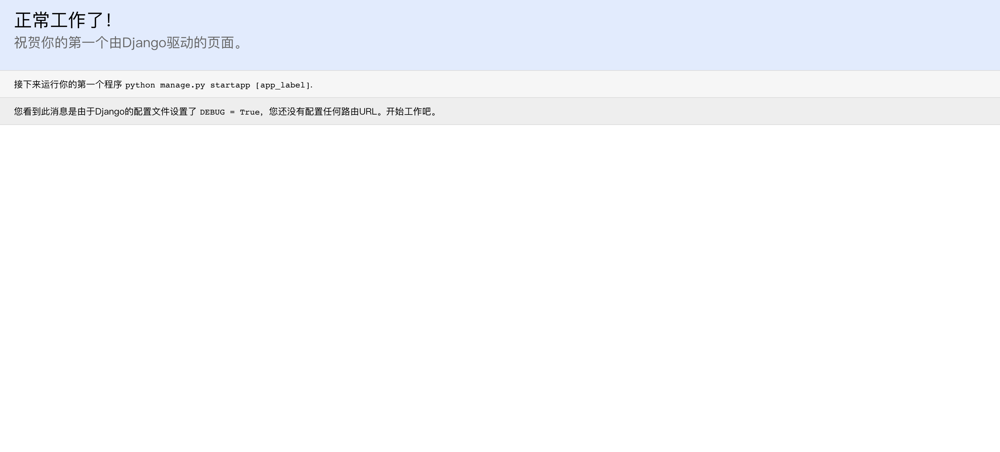
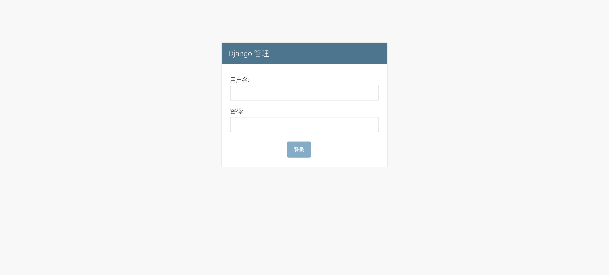
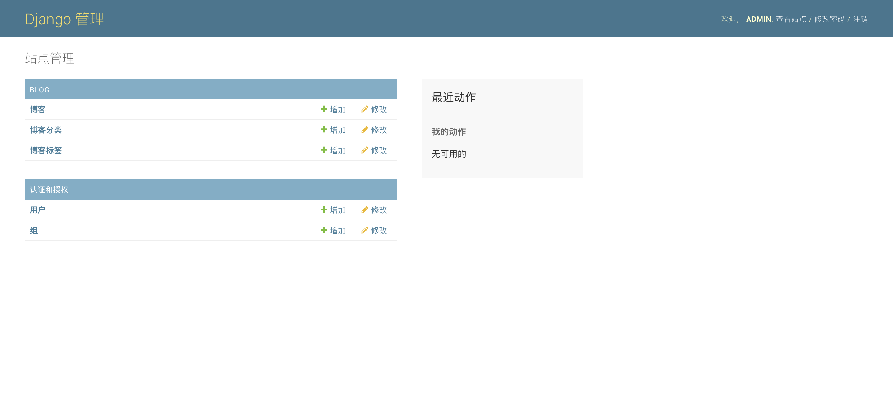
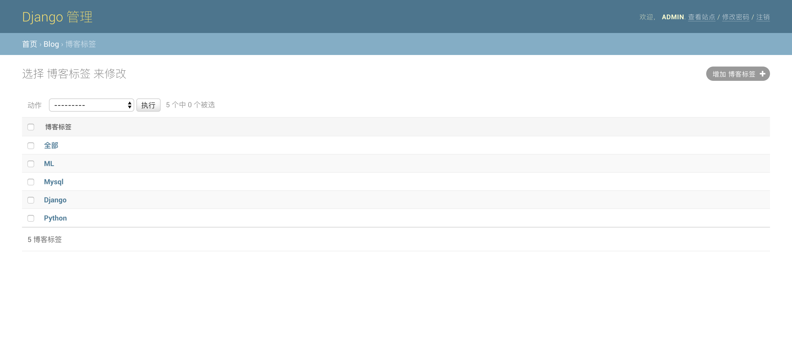
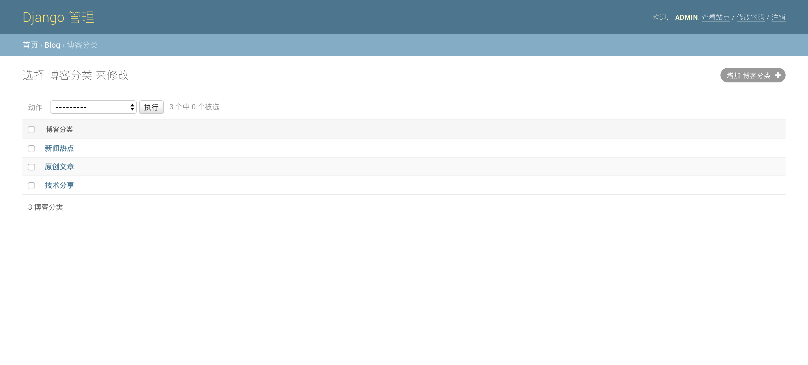

# learn_django

### 1.MacOS基础环境
```bash
//brew install
/usr/bin/ruby -e "$(curl -fsSL https://raw.githubusercontent.com/Homebrew/install/master/install)"
brew update

//mysql install
brew install mysql

//redis install
brew install redis

//tree install
brew install tree

//command alias
sed -ie /tree/d ~/.bash_profile
sed -ie /ls/d ~/.bash_profile
echo "alias tree='tree -N'"|tee -a ~/.bash_profile
echo "alias ll='ls -l'"|tee -a ~/.bash_profile

//pip source
mkdir -p ~/.pip
cat > ~/.pip/pip.conf <<EOF
[global]
trusted-host=mirrors.aliyun.com
index-url=http://mirrors.aliyun.com/pypi/simple/
[list]
format=columns
EOF

//git config
git config --global user.name "penn"
git config --global user.email "smallasa@sina.com"
git config --global push.default simple
git config --global core.quotepath false
git config --global credential.helper store --file=.git-credentials
git config --global core.editor vim
git config --global merge.tool vimdiff

//pip3 install Django
pip3 install Django==1.11

//pip3 install mysqlclient
brew uninstall mysql
brew install mysql-connector-c

vim /usr/local/bin/mysql_config
将：
libs="-L$pkglibdir"
libs="$libs -l "
改为：
libs="-L$pkglibdir"
libs="$libs -lmysqlclient -lssl -lcrypto"

vim ~/.bash_profile
export LDFLAGS="-L/usr/local/opt/openssl/lib"
export CPPFLAGS="-I/usr/local/opt/openssl/include"

pip3 install mysqlclient

brew link --overwrite mysql

拓展：
如果是在windows下面安装,会报错:
error: Microsoft Visual C++ 14.0 is required. Get it with "Microsoft Visual C++ Build Tools"
解决方法:
1.在浏览器中打开“https://www.lfd.uci.edu/~gohlke/pythonlibs/#twisted”地址
2.下载你需要安装软件包,请对应相应的python版本和系统版本
3.安装:pip install mysqlclient-1.3.13-cp36-cp36m-win_amd64.whl

//mysql start
mysql.server start
mysql -uroot
```

### 2.Django基础环境
```bash
liupengdeMacBook-Pro:~ liupeng$ python3 -V
Python 3.6.6

liupengdeMacBook-Pro:~ liupeng$ pip3 -V
pip 18.0 from /Library/Frameworks/Python.framework/Versions/3.6/lib/python3.6/site-packages/pip (python 3.6)

liupengdeMacBook-Pro:~ liupeng$ pip3 list
Package     Version
----------- -------
Django      1.11
mysqlclient 1.3.13
pip         18.0
pytz        2018.5
setuptools  40.4.3


liupengdeMacBook-Pro:~ liupeng$ mysql -uroot
mysql> select version();
+-----------+
| version() |
+-----------+
| 8.0.12    |
+-----------+
mysql> create database website;
mysql> create user 'website'@'localhost' identified by 'websitepass';
mysql> grant all privileges on website.* to 'website'@'localhost';
mysql> flush privileges;
mysql> show grants for 'website'@'localhost';
+--------------------------------------------------------------+
| Grants for website@localhost                                 |
+--------------------------------------------------------------+
| GRANT USAGE ON *.* TO `website`@`localhost`                  |
| GRANT ALL PRIVILEGES ON `website`.* TO `website`@`localhost` |
+--------------------------------------------------------------+
liupengdeMacBook-Pro:~ liupeng$ mysql -uwebsite -pwebsitepass -hlocalhost -P3306 -e "show databases;"
mysql: [Warning] Using a password on the command line interface can be insecure.
+--------------------+
| Database           |
+--------------------+
| information_schema |
| website            |
+--------------------+
注意：mysql 8.0 使用如下方法授权是错误的
grant all privileges on website.* to 'website'@'localhost' identified by 'websitepass' with grant option;
```


### 3.搭建项目环境
1.修改settings.py文件
```text
LANGUAGE_CODE = 'zh-hans'
TIME_ZONE = 'Asia/Shanghai'
USE_I18N = True
USE_L10N = True
USE_TZ = False
```

2.初次启动Django,浏览器中输入:http://127.0.0.1:8000/  



### 4.模型设计
1.设计博客模型
```bash
编辑"website/blog/models.py"：

from django.db import models
# 导入Django User方法
from django.contrib.auth.models import User
# Create your models here.


# 分类模型
class Category(models.Model):
    name = models.CharField(max_length=128, verbose_name='博客分类')

    def __str__(self):
        return self.name

    class Meta:
        verbose_name = '博客分类'
        verbose_name_plural = '博客分类'


# 标签模型
class Tag(models.Model):
    name = models.CharField(max_length=128, verbose_name='博客标签')

    def __str__(self):
        return self.name

    class Meta:
        verbose_name = '博客标签'
        verbose_name_plural = '博客标签'


# 博客模型
class Entry(models.Model):
    title = models.CharField(max_length=128, verbose_name='博客标题')
    author = models.ForeignKey(User, verbose_name='博客作者')
    img = models.ImageField(upload_to='blog_images', null=True, blank=True, verbose_name='博客图片')
    body = models.TextField(verbose_name='博客正文')
    abstract = models.TextField(max_length=256, null=True, blank=True, verbose_name='博客摘要')
    visiting = models.PositiveIntegerField(default=0, verbose_name='博客访问量')
    category = models.ManyToManyField('Category', verbose_name='博客分类')
    tags = models.ManyToManyField('Tag', verbose_name='博客标签')
    created_time = models.DateTimeField(auto_now_add=True, verbose_name='创建时间')
    modified_time = models.DateTimeField(auto_now=True, verbose_name='修改时间')

    def __str__(self):
        return self.title

    class Meta:
        ordering = ['-created_time']
        verbose_name = '博客'
        verbose_name_plural = '博客'

```

2.通过后台admin管理模型
```bash
编辑"website/blog/admin.py"：

from django.contrib import admin
# 导入models模块
from . import models
# Register your models here.


# 对于博客，需要定制一下显示方式
class EntryAdmin(admin.ModelAdmin):
    list_display = ['title', 'author', 'visiting', 'created_time', 'modified_time']

# 注册
admin.site.register(models.Category)
admin.site.register(models.Tag)
admin.site.register(models.Entry)
```

3.建立数据文件和应用到数据库
```bash
//安装pillow模块
(venv) liupengdeMacBook-Pro:website liupeng$ pip install pillow

//创建SQL数据文件
(venv) liupengdeMacBook-Pro:website liupeng$ python manage.py makemigrations
Migrations for 'blog':
  blog/migrations/0001_initial.py
    - Create model Category
    - Create model Entry
    - Create model Tag
    - Add field tags to entry

//根据SQL数据文件，应用到数据库
(venv) liupengdeMacBook-Pro:website liupeng$ python manage.py migrate
Operations to perform:
  Apply all migrations: admin, auth, blog, contenttypes, sessions
Running migrations:
  Applying contenttypes.0001_initial... OK
  Applying auth.0001_initial... OK
  Applying admin.0001_initial... OK
  Applying admin.0002_logentry_remove_auto_add... OK
  Applying contenttypes.0002_remove_content_type_name... OK
  Applying auth.0002_alter_permission_name_max_length... OK
  Applying auth.0003_alter_user_email_max_length... OK
  Applying auth.0004_alter_user_username_opts... OK
  Applying auth.0005_alter_user_last_login_null... OK
  Applying auth.0006_require_contenttypes_0002... OK
  Applying auth.0007_alter_validators_add_error_messages... OK
  Applying auth.0008_alter_user_username_max_length... OK
  Applying blog.0001_initial... OK
  Applying sessions.0001_initial... OK
```

4.创建后台管理员账号
```bash
(venv) liupengdeMacBook-Pro:website liupeng$ python manage.py createsuperuser
Username (leave blank to use 'liupeng'): admin
Email address: smallasa@sina.com
Password:  输入密码：123qwe``
Password (again): 输入密码：123qwe`` 
Superuser created successfully.
```

5.启动website
```bash
(venv) liupengdeMacBook-Pro:website liupeng$ python manage.py runserver
```

6.在浏览器中访问  
```bash
在浏览器中输入URL：http://127.0.0.1:8000/admin
输入账号：admin
输入密码：123qwe``

具体操作如下图：
```
website登录前首页：


website登录后首页： 


website登录后，创建标签:


website登录后，创建分类:


```bash
至此，博客后台管理初步完成！但注意,此时我们使用的是db.sqlite3数据库进行存储数据。
```


### 5.使用Mysql数据库
1.安装依赖库
```bash
(venv) liupengdeMacBook-Pro:website liupeng$ pip list |grep mysqlclient
mysqlclient 1.3.13 
```

2.配置Django默认setting中的数据库
```bash
编辑"website/website/settings.py":

DATABASES = {
    'default': {
        'ENGINE': 'django.db.backends.mysql',
        'NAME': 'website',
        'USER': 'website',
        'PASSWORD': 'websitepass',
        'HOST': 'localhost',
        'PORT': '3306',
    }
}
```

3.建立数据文件和应用到数据库
```bash
//创建SQL数据文件
(venv) liupengdeMacBook-Pro:website liupeng$ python manage.py makemigrations
No changes detected

//根据SQL数据文件，应用到数据库
(venv) liupengdeMacBook-Pro:website liupeng$ python manage.py migrate
Operations to perform:
  Apply all migrations: admin, auth, blog, contenttypes, sessions
Running migrations:
  Applying contenttypes.0001_initial... OK
  Applying auth.0001_initial... OK
  Applying admin.0001_initial... OK
  Applying admin.0002_logentry_remove_auto_add... OK
  Applying contenttypes.0002_remove_content_type_name... OK
  Applying auth.0002_alter_permission_name_max_length... OK
  Applying auth.0003_alter_user_email_max_length... OK
  Applying auth.0004_alter_user_username_opts... OK
  Applying auth.0005_alter_user_last_login_null... OK
  Applying auth.0006_require_contenttypes_0002... OK
  Applying auth.0007_alter_validators_add_error_messages... OK
  Applying auth.0008_alter_user_username_max_length... OK
  Applying blog.0001_initial... OK
  Applying sessions.0001_initial... OK


注意：如果出现如下错误是由于mysql 8.0的安全机制造成的
django.db.utils.OperationalError: (2059, "Authentication plugin 'caching_sha2_password' cannot be loaded: dlopen(/usr/local/Cellar/mysql-connector-c/6.1.11/lib/plugin/caching_sha2_password.so, 2): image not found")

解决方法：
liupengdeMacBook-Pro:~ liupeng$ mysql -uroot
mysql> alter user 'website'@'localhost' identified with mysql_native_password by 'websitepass';
mysql> flush privileges;
```

4.查看数据库中创建的表
```bash
(venv) liupengdeMacBook-Pro:website liupeng$ mysql -uwebsite -pwebsitepass -hlocalhost -P3306  website -e "show tables;"
mysql: [Warning] Using a password on the command line interface can be insecure.
+----------------------------+
| Tables_in_website          |
+----------------------------+
| auth_group                 |
| auth_group_permissions     |
| auth_permission            |
| auth_user                  |
| auth_user_groups           |
| auth_user_user_permissions |
| blog_category              |
| blog_entry                 |
| blog_entry_category        |
| blog_entry_tags            |
| blog_tag                   |
| django_admin_log           |
| django_content_type        |
| django_migrations          |
| django_session             |
+----------------------------+
```

5.创建后台管理员账号
```bash
(venv) liupengdeMacBook-Pro:website liupeng$ python manage.py createsuperuser
Username (leave blank to use 'liupeng'): admin
Email address: smallasa@sina.com
Password: 输入：123qwe``
Password (again): 输入：123qwe``
Superuser created successfully.
```

6.启动website
```bash
(venv) liupengdeMacBook-Pro:website liupeng$ python manage.py runserver
```

7.在浏览器中访问  
```bash
在浏览器中输入URL：http://127.0.0.1:8000/admin
输入账号：admin
输入密码：123qwe``

具体操作如下图：
```
website登录前首页：


website登录后首页： 


website登录后，创建标签:


website登录后，创建分类:


```bash
至此，博客后台管理初步完成！但注意,此时我们使用的是Mysql数据库进行存储数据。
```
