# learn_django

### 1.MacOS基础环境
```bash
//brew install
/usr/bin/ruby -e "$(curl -fsSL https://raw.githubusercontent.com/Homebrew/install/master/install)"
brew update

//mysql install
brew install mysql

//redis install
brew install redis

//tree install
brew install tree

//command alias
sed -ie /tree/d ~/.bash_profile
sed -ie /ls/d ~/.bash_profile
echo "alias tree='tree -N'"|tee -a ~/.bash_profile
echo "alias ll='ls -l'"|tee -a ~/.bash_profile

//pip source
mkdir -p ~/.pip
cat > ~/.pip/pip.conf <<EOF
[global]
trusted-host=mirrors.aliyun.com
index-url=http://mirrors.aliyun.com/pypi/simple/
[list]
format=columns
EOF

//git config
git config --global user.name "penn"
git config --global user.email "smallasa@sina.com"
git config --global push.default simple
git config --global core.quotepath false
git config --global credential.helper store --file=.git-credentials
git config --global core.editor vim
git config --global merge.tool vimdiff

//pip3 install Django
pip3 install Django==1.11

//pip3 install mysqlclient
brew uninstall mysql
brew install mysql-connector-c

vim /usr/local/bin/mysql_config
将：
libs="-L$pkglibdir"
libs="$libs -l "
改为：
libs="-L$pkglibdir"
libs="$libs -lmysqlclient -lssl -lcrypto"

vim ~/.bash_profile
export LDFLAGS="-L/usr/local/opt/openssl/lib"
export CPPFLAGS="-I/usr/local/opt/openssl/include"

pip3 install mysqlclient

brew link --overwrite mysql

拓展：
如果是在windows下面安装,会报错:
error: Microsoft Visual C++ 14.0 is required. Get it with "Microsoft Visual C++ Build Tools"
解决方法:
1.在浏览器中打开“https://www.lfd.uci.edu/~gohlke/pythonlibs/#twisted”地址
2.下载你需要安装软件包,请对应相应的python版本和系统版本
3.安装:pip install mysqlclient-1.3.13-cp36-cp36m-win_amd64.whl

//mysql start
mysql.server start
mysql -uroot
```

### 2.Django基础环境
```bash
liupengdeMacBook-Pro:~ liupeng$ python3 -V
Python 3.6.6

liupengdeMacBook-Pro:~ liupeng$ pip3 -V
pip 18.0 from /Library/Frameworks/Python.framework/Versions/3.6/lib/python3.6/site-packages/pip (python 3.6)

liupengdeMacBook-Pro:~ liupeng$ pip3 list
Package     Version
----------- -------
Django      1.11
mysqlclient 1.3.13
pip         18.0
pytz        2018.5
setuptools  40.4.3


liupengdeMacBook-Pro:~ liupeng$ mysql -uroot
mysql> select version();
+-----------+
| version() |
+-----------+
| 8.0.12    |
+-----------+
mysql> create database website;
mysql> create user 'website'@'localhost' identified by 'websitepass';
mysql> grant all privileges on website.* to 'website'@'localhost';
mysql> flush privileges;
mysql> show grants for 'website'@'localhost';
+--------------------------------------------------------------+
| Grants for website@localhost                                 |
+--------------------------------------------------------------+
| GRANT USAGE ON *.* TO `website`@`localhost`                  |
| GRANT ALL PRIVILEGES ON `website`.* TO `website`@`localhost` |
+--------------------------------------------------------------+
liupengdeMacBook-Pro:~ liupeng$ mysql -uwebsite -pwebsitepass -hlocalhost -P3306 -e "show databases;"
mysql: [Warning] Using a password on the command line interface can be insecure.
+--------------------+
| Database           |
+--------------------+
| information_schema |
| website            |
+--------------------+
注意：mysql 8.0 使用如下方法授权是错误的
grant all privileges on website.* to 'website'@'localhost' identified by 'websitepass' with grant option;
```


### 3.搭建项目环境
1.修改settings.py文件
```text
LANGUAGE_CODE = 'zh-hans'
TIME_ZONE = 'Asia/Shanghai'
USE_I18N = True
USE_L10N = True
USE_TZ = False
```

2.初次启动Django,浏览器中输入:http://127.0.0.1:8000/  


### 4.模型设计
1.设计博客模型
```bash
编辑"website/blog/models.py"：

from django.db import models
# 导入Django User方法
from django.contrib.auth.models import User
# Create your models here.


# 分类模型
class Category(models.Model):
    name = models.CharField(max_length=128, verbose_name='博客分类')

    def __str__(self):
        return self.name

    class Meta:
        verbose_name = '博客分类'
        verbose_name_plural = '博客分类'


# 标签模型
class Tag(models.Model):
    name = models.CharField(max_length=128, verbose_name='博客标签')

    def __str__(self):
        return self.name

    class Meta:
        verbose_name = '博客标签'
        verbose_name_plural = '博客标签'


# 博客模型
class Entry(models.Model):
    title = models.CharField(max_length=128, verbose_name='博客标题')
    author = models.ForeignKey(User, verbose_name='博客作者')
    img = models.ImageField(upload_to='blog_images', null=True, blank=True, verbose_name='博客图片')
    body = models.TextField(verbose_name='博客正文')
    abstract = models.TextField(max_length=256, null=True, blank=True, verbose_name='博客摘要')
    visiting = models.PositiveIntegerField(default=0, verbose_name='博客访问量')
    category = models.ManyToManyField('Category', verbose_name='博客分类')
    tags = models.ManyToManyField('Tag', verbose_name='博客标签')
    created_time = models.DateTimeField(auto_now_add=True, verbose_name='创建时间')
    modified_time = models.DateTimeField(auto_now=True, verbose_name='修改时间')

    def __str__(self):
        return self.title

    class Meta:
        ordering = ['-created_time']
        verbose_name = '博客'
        verbose_name_plural = '博客'

```

2.通过后台admin管理模型
```bash
编辑"website/blog/admin.py"：

from django.contrib import admin
# 导入models模块
from . import models
# Register your models here.


# 对于博客，需要定制一下显示方式
class EntryAdmin(admin.ModelAdmin):
    list_display = ['title', 'author', 'visiting', 'created_time', 'modified_time']

# 注册
admin.site.register(models.Category)
admin.site.register(models.Tag)
admin.site.register(models.Entry)
```

3.建立数据文件和应用到数据库
```bash
//安装pillow模块
(venv) liupengdeMacBook-Pro:website liupeng$ pip install pillow

//创建SQL数据文件
(venv) liupengdeMacBook-Pro:website liupeng$ python manage.py makemigrations
Migrations for 'blog':
  blog/migrations/0001_initial.py
    - Create model Category
    - Create model Entry
    - Create model Tag
    - Add field tags to entry

//根据SQL数据文件，应用到数据库
(venv) liupengdeMacBook-Pro:website liupeng$ python manage.py migrate
Operations to perform:
  Apply all migrations: admin, auth, blog, contenttypes, sessions
Running migrations:
  Applying contenttypes.0001_initial... OK
  Applying auth.0001_initial... OK
  Applying admin.0001_initial... OK
  Applying admin.0002_logentry_remove_auto_add... OK
  Applying contenttypes.0002_remove_content_type_name... OK
  Applying auth.0002_alter_permission_name_max_length... OK
  Applying auth.0003_alter_user_email_max_length... OK
  Applying auth.0004_alter_user_username_opts... OK
  Applying auth.0005_alter_user_last_login_null... OK
  Applying auth.0006_require_contenttypes_0002... OK
  Applying auth.0007_alter_validators_add_error_messages... OK
  Applying auth.0008_alter_user_username_max_length... OK
  Applying blog.0001_initial... OK
  Applying sessions.0001_initial... OK
```

4.创建后台管理员账号
```bash
(venv) liupengdeMacBook-Pro:website liupeng$ python manage.py createsuperuser
Username (leave blank to use 'liupeng'): admin
Email address: smallasa@sina.com
Password:  输入密码：123qwe``
Password (again): 输入密码：123qwe`` 
Superuser created successfully.
```

5.启动website
```bash
(venv) liupengdeMacBook-Pro:website liupeng$ python manage.py runserver
```

6.在浏览器中访问  
```bash
在浏览器中输入URL：http://127.0.0.1:8000/admin
输入账号：admin
输入密码：123qwe``

具体操作如下图：
```
website登录前首页：


website登录后首页： 


website登录后，创建标签:


website登录后，创建分类:


```bash
至此，博客后台管理初步完成！但注意,此时我们使用的是db.sqlite3数据库进行存储数据。
```


### 5.使用Mysql数据库
1.安装依赖库
```bash
(venv) liupengdeMacBook-Pro:website liupeng$ pip list |grep mysqlclient
mysqlclient 1.3.13 
```

2.配置Django默认setting中的数据库
```bash
编辑"website/website/settings.py":

DATABASES = {
    'default': {
        'ENGINE': 'django.db.backends.mysql',
        'NAME': 'website',
        'USER': 'website',
        'PASSWORD': 'websitepass',
        'HOST': 'localhost',
        'PORT': '3306',
    }
}
```

3.建立数据文件和应用到数据库
```bash
//创建SQL数据文件
(venv) liupengdeMacBook-Pro:website liupeng$ python manage.py makemigrations
No changes detected

//根据SQL数据文件，应用到数据库
(venv) liupengdeMacBook-Pro:website liupeng$ python manage.py migrate
Operations to perform:
  Apply all migrations: admin, auth, blog, contenttypes, sessions
Running migrations:
  Applying contenttypes.0001_initial... OK
  Applying auth.0001_initial... OK
  Applying admin.0001_initial... OK
  Applying admin.0002_logentry_remove_auto_add... OK
  Applying contenttypes.0002_remove_content_type_name... OK
  Applying auth.0002_alter_permission_name_max_length... OK
  Applying auth.0003_alter_user_email_max_length... OK
  Applying auth.0004_alter_user_username_opts... OK
  Applying auth.0005_alter_user_last_login_null... OK
  Applying auth.0006_require_contenttypes_0002... OK
  Applying auth.0007_alter_validators_add_error_messages... OK
  Applying auth.0008_alter_user_username_max_length... OK
  Applying blog.0001_initial... OK
  Applying sessions.0001_initial... OK


注意：如果出现如下错误是由于mysql 8.0的安全机制造成的
django.db.utils.OperationalError: (2059, "Authentication plugin 'caching_sha2_password' cannot be loaded: dlopen(/usr/local/Cellar/mysql-connector-c/6.1.11/lib/plugin/caching_sha2_password.so, 2): image not found")

解决方法：
liupengdeMacBook-Pro:~ liupeng$ mysql -uroot
mysql> alter user 'website'@'localhost' identified with mysql_native_password by 'websitepass';
mysql> flush privileges;
```

4.查看数据库中创建的表
```bash
(venv) liupengdeMacBook-Pro:website liupeng$ mysql -uwebsite -pwebsitepass -hlocalhost -P3306  website -e "show tables;"
mysql: [Warning] Using a password on the command line interface can be insecure.
+----------------------------+
| Tables_in_website          |
+----------------------------+
| auth_group                 |
| auth_group_permissions     |
| auth_permission            |
| auth_user                  |
| auth_user_groups           |
| auth_user_user_permissions |
| blog_category              |
| blog_entry                 |
| blog_entry_category        |
| blog_entry_tags            |
| blog_tag                   |
| django_admin_log           |
| django_content_type        |
| django_migrations          |
| django_session             |
+----------------------------+
```

5.创建后台管理员账号
```bash
(venv) liupengdeMacBook-Pro:website liupeng$ python manage.py createsuperuser
Username (leave blank to use 'liupeng'): admin
Email address: smallasa@sina.com
Password: 输入：123qwe``
Password (again): 输入：123qwe``
Superuser created successfully.
```

6.启动website
```bash
(venv) liupengdeMacBook-Pro:website liupeng$ python manage.py runserver
```

7.在浏览器中访问  
```bash
在浏览器中输入URL：http://127.0.0.1:8000/admin
输入账号：admin
输入密码：123qwe``

具体操作如下图：
```
website登录前首页：


website登录后首页： 


website登录后，创建标签:


website登录后，创建分类:


```bash
至此，博客后台管理初步完成！但注意,此时我们使用的是Mysql数据库进行存储数据。
```


### 6.URL及视图设计
1.修改主路由配置文件
```bash
编辑"website/websitte/urls.py":

from django.conf.urls import url
from django.contrib import admin
# 导入include模块
from django.conf.urls import include


urlpatterns = [
    url(r'^admin/', admin.site.urls),
    # 创建二级路由(转向APP自己路由地址)
    url(r'^blog/', include('blog.urls')),
]
```

2.在APP内部创建路由文件
```bash
创建并编辑"website/blog/urls.py":

# 导入url模块
from django.conf.urls import url
# 导入view试图模块
from . import views


#定义APP名字
app_name = 'blog'


urlpatterns = {
    url(r'^$', views.index, name='blog_index'),
    url(r'^(?P<blog_id>[0-9]+)', views.detail, name='blog_detail'),
}


注意: 一定要注意路由的设定，很容易出现404，有可能是路由设置有问题，未匹配
```

3.在APP内部修改视图
```bash
编辑"website/blog/views.py":

from django.shortcuts import render

# Create your views here.
def index(request):
    return render(request, 'blog/index.html', locals())

# 由于路由中有传参，所以定义视图时，需要把参数也写上
def detail(request, blog_id):
    return render(request, 'blog/detail.html', locals())


注意: 由视图去转向HTML
```

4.在APP项目下创建HTML文件
```bash
//创建存放html的目录
(venv) liupengdeMacBook-Pro:website liupeng$ mkdir -p blog/templates/blog

//创建website/blog/templates/blog/index.html
<!DOCTYPE html>
<html lang="en">
<head>
    <meta charset="UTF-8">
    <title>首页</title>
</head>
<body>
    <h1>博客首页</h1>
</body>
</html>

//创建website/blog/templates/blog/detail.html
<!DOCTYPE html>
<html lang="en">
<head>
    <meta charset="UTF-8">
    <title>博客页面</title>
</head>
<body>
    <h1>博客{{ blog_id }}页面</h1>
</body>
</html>
```

5.启动服务
```bash
(venv) liupengdeMacBook-Pro:website liupeng$ python manage.py runserver
```

6.在浏览器中访问  
blog首页:  http://127.0.0.1:8000/blog  


blog二级目录: http://127.0.0.1:8000/blog/2


7.URL和视图的顺序规则
```text
由上可知，URL设计及视图设计的顺序步骤如下:
首先，修改"website/website/urls.py"文件，定义二级路由。
其次，修改"website/blog/urls.py"文件，定义应用自己的路由规则，路由规则指向视图。
然后，修改"website/blog/views.py"文件，定义应用自己的视图，并指向静态HTML页面。
最后，创建HTML目录并编写HTML静态页面。
```


### 7.前端页面设计
1.基于Bootstrap框架，创建html基础模板
```bash
打开"https://v3.bootcss.com/getting-started/"，
将基本模板里面的HTML代码拷贝一下，
然后创建并编辑"website/blog/templates/blog/base.html"

<!DOCTYPE html>
<html lang="zh-CN">
  <head>
    <meta charset="utf-8">
    <meta http-equiv="X-UA-Compatible" content="IE=edge">
    <meta name="viewport" content="width=device-width, initial-scale=1">
    <!-- 上述3个meta标签*必须*放在最前面，任何其他内容都*必须*跟随其后！ -->
    <!--设定title block-->
    <title>基本模版</title>

    <!-- Bootstrap -->
    <link href="https://cdn.jsdelivr.net/npm/bootstrap@3.3.7/dist/css/bootstrap.min.css" rel="stylesheet">

    <!-- HTML5 shim 和 Respond.js 是为了让 IE8 支持 HTML5 元素和媒体查询（media queries）功能 -->
    <!-- 警告：通过 file:// 协议（就是直接将 html 页面拖拽到浏览器中）访问页面时 Respond.js 不起作用 -->
    <!--[if lt IE 9]>
      <script src="https://cdn.jsdelivr.net/npm/html5shiv@3.7.3/dist/html5shiv.min.js"></script>
      <script src="https://cdn.jsdelivr.net/npm/respond.js@1.4.2/dest/respond.min.js"></script>
    <![endif]-->
  </head>
  <body>
    <!--设定content block-->
    

    


    <!-- jQuery (Bootstrap 的所有 JavaScript 插件都依赖 jQuery，所以必须放在前边) -->
    <script src="https://cdn.jsdelivr.net/npm/jquery@1.12.4/dist/jquery.min.js"></script>
    <!-- 加载 Bootstrap 的所有 JavaScript 插件。你也可以根据需要只加载单个插件。 -->
    <script src="https://cdn.jsdelivr.net/npm/bootstrap@3.3.7/dist/js/bootstrap.min.js"></script>

    <!--设定script block-->
    

    
  </body>
</html>

注意：
1.设置标签为" xxxx "的好处是可以被子模板继承，进行替换。
2.上面css和js文件是直接访问CDN进行生成的
```

2.编辑"website/blog/templates/blog/index.html"，继承base.html模版
```bash

博客首页


    博客首页

```

3.启动服务，在浏览器中输入http://127.0.0.1:8000/blog


4.将bootstrap和jquery下载到本地,进行开发
```bash
1.打开"https://v3.bootcss.com/"，下载bootstrap-3.3.7-dist.zip
2.打开"https://jquery.com/download/",下载jquery-3.3.1.min.js
3.创建"website/static"目录
4.将bootstrap-3.3.7-dist.zip解压到"website/static"目录
5.将jquery-3.3.1.min.js拷贝到"website/static"目录

6.编辑"website/website/setting.py",将static目录引入
STATIC_URL = '/static/'
STATICFILES_DIRS = [
    os.path.join(BASE_DIR, 'static'),
]

7.重新编辑"website/blog/templates/blog/base.html"
<!--先加载static files-->

<!DOCTYPE html>
<html lang="zh-CN">
  <head>
    <meta charset="utf-8">
    <meta http-equiv="X-UA-Compatible" content="IE=edge">
    <meta name="viewport" content="width=device-width, initial-scale=1">
    <!-- 上述3个meta标签*必须*放在最前面，任何其他内容都*必须*跟随其后！ -->
    <!--设定title block-->
    <title>基本模版</title>

    <!-- 引用本地 Bootstrap -->
    <link href="" rel="stylesheet">

    <!-- HTML5 shim 和 Respond.js 是为了让 IE8 支持 HTML5 元素和媒体查询（media queries）功能 -->
    <!-- 警告：通过 file:// 协议（就是直接将 html 页面拖拽到浏览器中）访问页面时 Respond.js 不起作用 -->
    <!--[if lt IE 9]>
      <script src="https://cdn.jsdelivr.net/npm/html5shiv@3.7.3/dist/html5shiv.min.js"></script>
      <script src="https://cdn.jsdelivr.net/npm/respond.js@1.4.2/dest/respond.min.js"></script>
    <![endif]-->
  </head>
  <body>
    <!--设定content block-->
    

    


    <!-- 重新加载本地jQuery (Bootstrap 的所有 JavaScript 插件都依赖 jQuery，所以必须放在前边) -->
    <script src=""></script>
    <!-- 重新加载本地 Bootstrap 的所有 JavaScript 插件。你也可以根据需要只加载单个插件。 -->
    <script src=""></script>

    <!--设定script block-->
    

    
  </body>
</html>

8.重启服务，并访问http://127.0.0.1:8000/blog,结果与步骤3一样.
```

5.设置导航页
```bash
1.打开"https://v3.bootcss.com/components/#navbar",将导航条代码进行复制
2.编辑"website/blog/templates/blog/base.html"，将代码复制到<body></body>中，进行修改。
<!--先加载static files-->

<!DOCTYPE html>
<html lang="zh-CN">
<head>
    <meta charset="utf-8">
    <meta http-equiv="X-UA-Compatible" content="IE=edge">
    <meta name="viewport" content="width=device-width, initial-scale=1">
    <!-- 上述3个meta标签*必须*放在最前面，任何其他内容都*必须*跟随其后！ -->
    <!--设定title block-->
    <title>基本模版</title>

    <!-- 引用本地 Bootstrap -->
    <link href="" rel="stylesheet">

    <!-- HTML5 shim 和 Respond.js 是为了让 IE8 支持 HTML5 元素和媒体查询（media queries）功能 -->
    <!-- 警告：通过 file:// 协议（就是直接将 html 页面拖拽到浏览器中）访问页面时 Respond.js 不起作用 -->
    <!--[if lt IE 9]>
      <script src="https://cdn.jsdelivr.net/npm/html5shiv@3.7.3/dist/html5shiv.min.js"></script>
      <script src="https://cdn.jsdelivr.net/npm/respond.js@1.4.2/dest/respond.min.js"></script>
    <![endif]-->
</head>
<body>
<!--导航条设置-->
<nav class="navbar navbar-default">
    <div class="container-fluid">
        <!-- Brand and toggle get grouped for better mobile display -->
        <div class="navbar-header">
            <button type="button" class="navbar-toggle collapsed" data-toggle="collapse"
                    data-target="#my-nav" aria-expanded="false">
                <span class="sr-only">Toggle navigation</span>
                <span class="icon-bar"></span>
                <span class="icon-bar"></span>
                <span class="icon-bar"></span>
            </button>
            <a class="navbar-brand" href="#">我的博客网站</a>
        </div>

        <!-- Collect the nav links, forms, and other content for toggling -->
        <div class="collapse navbar-collapse" id="my-nav">
            <ul class="nav navbar-nav">
                <li class="active"><a href="#">博客</a></li>
                <li ><a href="#">关于博主</a></li>
                <li ><a href="#">联系我们</a></li>
            </ul>
            <form class="navbar-form navbar-left">
                <div class="form-group">
                    <input type="text" class="form-control" placeholder="Search">
                </div>
                <button type="submit" class="btn btn-default">搜索</button>
            </form>
            <ul class="nav navbar-nav navbar-right">
                <li><a href="#">登录</a></li>
            </ul>
        </div><!-- /.navbar-collapse -->
    </div><!-- /.container-fluid -->
</nav>


<!--设定content block-->





<!-- 重新加载本地jQuery (Bootstrap 的所有 JavaScript 插件都依赖 jQuery，所以必须放在前边) -->
<script src=""></script>
<!-- 重新加载本地 Bootstrap 的所有 JavaScript 插件。你也可以根据需要只加载单个插件。 -->
<script src=""></script>

<!--设定script block-->



</body>
</html>

3.启动服务，刷新查看其导航条
```
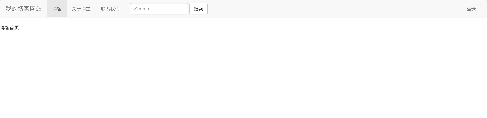

6.如何模仿别人的网站
```bash
1.打开"http://www.youzhan.org/",挑选自己感兴趣的网站。
2.打开"https://jupyter.org/"(我挑选的网站),登录到首页后，右击查看源代码。
注意：要模仿别人的前端页面，只需要查看css和js文件即可。
3.打开它的nav样式表:
"https://jupyter.org/css/logo-nav.css?1533935181478631422"。
4.拷贝它的body样式。
5.创建目录"website/blog/static/blog/css/"目录。
6.创建文件"website/blog/static/blog/css/blog-nav.css",并将body样式粘贴到里面。
7.修改文件"website/blog/templates/blog/base.html",导入样式文件blog-nav.css。如图:
    <!-- 引用本地 Bootstrap -->
    <link href="" rel="stylesheet">
    <!-- 引用blog/css/blog_nav.css -->
    <link href="" rel="stylesheet">
8.修改文件"website/blog/templates/blog/base.html",编辑nav样式
    <nav class="navbar navbar-default">
    改为:
    <nav class="navbar navbar-fixed-top">
9.编辑"website/blog/static/blog/css/blog_nav.css"
.navbar {
    color: black;
    border-width: thin;
    -webkit-transition: .2s;
    background-color: white;
    border-bottom: 1px solid #e0e0e0;
    background-color: white;
}
.navbar-fixed-top .navbar-brand {
    /*padding: 5px 0px;*/
    margin-left: 15px;
}
/*.navbar-logo {
    height: 35px;
}*/
.nav > li > a {
    font-size: 20px;
    padding: 12px 12px 10px;
}
9.修改完后，重启服务，浏览
```
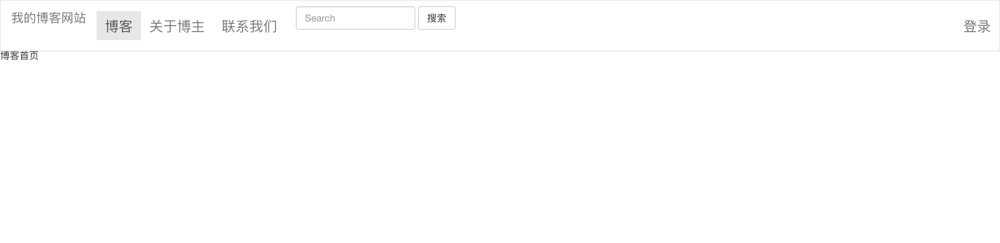

7.首页导入图片
```bash
1.在"www.easyicon.net"上找一张图片，并下载
2.创建"website/blog/blog/images"目录
3.将下载的图片复制粘贴到"website/blog/blog/images/blog_test.ico"
4.修改文件"website/blog/templates/blog/base.html"，插入图片
    <a class="navbar-brand" href="#">我的博客网站</a>
    改为：
    <a class="navbar-brand" href="#">
        
        <span class="navbar-text">我的博客</span>
    </a>
5.编辑"website/blog/static/blog/css/blog-nav.css"，调整图标位置
nav a img {
    width: 50px;
    height: 50px;
    display: inline-block;
    float: left;
}

nav .navbar-brand {
    padding-top: 10px;
}

nav a span {
    font-size: 24px;
}

nav .navbar-form {
    padding-top: 10px;
}

6.修改完后，刷新浏览器
```
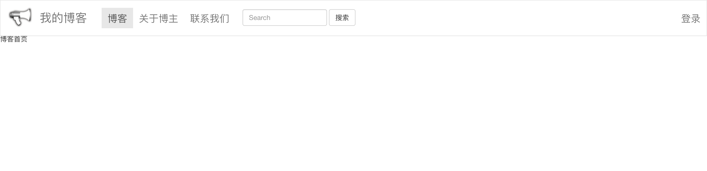

8.对首页插入页脚
```bash
1.编辑"website/blog/templates/blog/base.html"，在<body></body>中插入页脚代码。
<footer>
    <div class="footer" role="navigation">
        <div class="container">
            <div class="navbar-text">
                <ul class="footer-text">
                    <li><a href="#">主页</a></li>
                    <li><a href="#">联系我们</a></li>
                    <li><a href="#">关于博主</a></li>
                    <li><a href="#">文档支持</a></li>
                    <li><a href="#">博客首页</a></li>
                </ul>
                <p>Copyright © 2018 刘朋的博客</p>
            </div>
        </div>
    </div>
</footer>

2.刷新浏览器，进行查看
```
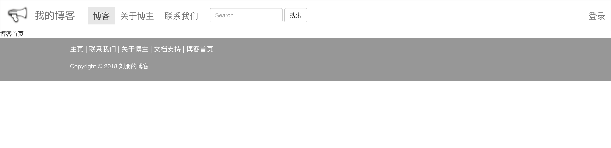

9.编辑"website/blog/templates/blog/base.html"
```bash
1.在nav导航条中设置：
  <li class="active"><a href="/blog/">博客</a></li>

2.在footer页脚中设置：
  <li><a href="/blog/">博客首页</a></li>

3.刷新浏览器，点击导航条的博客，以及页脚下面的博客首页，都会自动跳转到首页          
```

10.首页继承base.html模板，调出基本框架
```bash
1.编辑"website/blog/templates/blog/index.html"

博客首页


    <div class="container">
        <div class="row">
            adfalfals
        </div>
    </div>


2.刷新浏览器进行查看
```
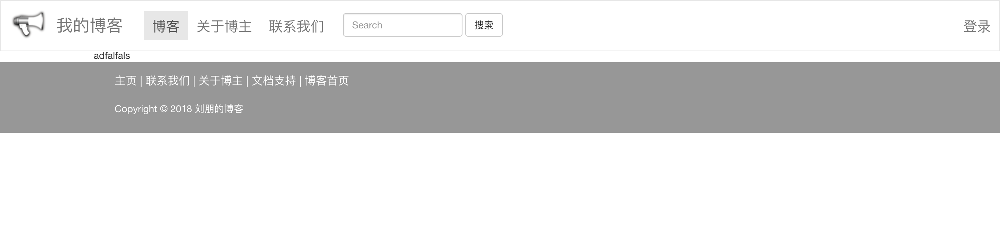

11.基础模板(base.html)的完整代码
```bash
<!--先加载static files-->

<!DOCTYPE html>
<html lang="zh-CN">
<head>
    <meta charset="utf-8">
    <meta http-equiv="X-UA-Compatible" content="IE=edge">
    <meta name="viewport" content="width=device-width, initial-scale=1">
    <!-- 上述3个meta标签*必须*放在最前面，任何其他内容都*必须*跟随其后！ -->
    <!--设定title block-->
    <title>基本模版</title>

    <!-- 引用本地 Bootstrap -->
    <link href="" rel="stylesheet">
    <!-- 引用blog/css/blog_nav.css -->
    <link href="" rel="stylesheet">

    <!-- HTML5 shim 和 Respond.js 是为了让 IE8 支持 HTML5 元素和媒体查询（media queries）功能 -->
    <!-- 警告：通过 file:// 协议（就是直接将 html 页面拖拽到浏览器中）访问页面时 Respond.js 不起作用 -->
    <!--[if lt IE 9]>
      <script src="https://cdn.jsdelivr.net/npm/html5shiv@3.7.3/dist/html5shiv.min.js"></script>
      <script src="https://cdn.jsdelivr.net/npm/respond.js@1.4.2/dest/respond.min.js"></script>
    <![endif]-->
</head>
<body>
<!--导航条设置-->
<nav class="navbar navbar-default navbar-fixed-top">
    <div class="container-fluid">
        <!-- Brand and toggle get grouped for better mobile display -->
        <div class="navbar-header">
            <button type="button" class="navbar-toggle collapsed" data-toggle="collapse"
                    data-target="#my-nav" aria-expanded="false">
                <span class="sr-only">Toggle navigation</span>
                <span class="icon-bar"></span>
                <span class="icon-bar"></span>
                <span class="icon-bar"></span>
            </button>
            <a class="navbar-brand" href="#">
                
                <span class="navbar-text">我的博客</span>
            </a>

        </div>

        <!-- Collect the nav links, forms, and other content for toggling -->
        <div class="collapse navbar-collapse" id="my-nav">
            <ul class="nav navbar-nav">
                <li class="active"><a href="/blog/">博客</a></li>
                <li><a href="#">关于博主</a></li>
                <li><a href="#">联系我们</a></li>
            </ul>
            <form class="navbar-form navbar-left">
                <div class="form-group">
                    <input type="text" class="form-control" placeholder="Search">
                </div>
                <button type="submit" class="btn btn-default">搜索</button>
            </form>
            <ul class="nav navbar-nav navbar-right">
                <li><a href="#">登录</a></li>
            </ul>
        </div><!-- /.navbar-collapse -->
    </div><!-- /.container-fluid -->
</nav>


<!--设定content block-->





<footer>
    <div class="footer" role="navigation">
        <div class="container">
            <div class="navbar-text">
                <ul class="footer-text">
                    <li><a href="#">主页</a></li>
                    <li><a href="#">联系我们</a></li>
                    <li><a href="#">关于博主</a></li>
                    <li><a href="#">文档支持</a></li>
                    <li><a href="/blog/">博客首页</a></li>
                </ul>
                <p>Copyright © 2018 刘朋的博客</p>
            </div>
        </div>
    </div>
</footer>

<!-- 重新加载本地jQuery (Bootstrap 的所有 JavaScript 插件都依赖 jQuery，所以必须放在前边) -->
<script src=""></script>
<!-- 重新加载本地 Bootstrap 的所有 JavaScript 插件。你也可以根据需要只加载单个插件。 -->
<script src=""></script>

<!--设定script block-->



</body>
</html>
```


### 8.博客首页设计
1.打开"http://127.0.0.1:8000/admin"，出现异常
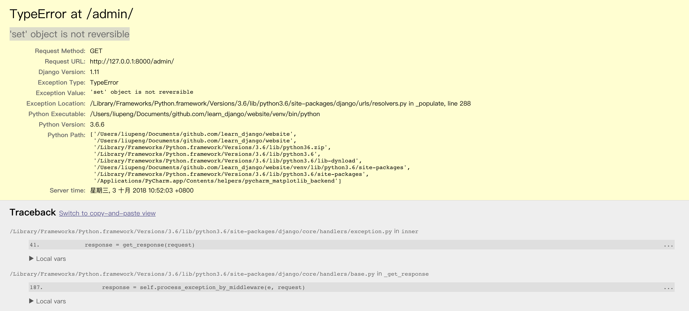
```bash
解决方法：
编辑"website/blog/urls.py"

将：
urlpatterns = {
    url(r'^$', views.index, name='blog_index'),
    url(r'^(?P<blog_id>[0-9]+)', views.detail, name='blog_detail'),
}
改为：
urlpatterns = [
    url(r'^$', views.index, name='blog_index'),
    url(r'^(?P<blog_id>[0-9]+)', views.detail, name='blog_detail'),
]
```

2.添加保存图片的路径
```bash
1.我们在"website/blog/models.py"中有定义
# 博客模型
class Entry(models.Model):
    img = models.ImageField(upload_to='blog_images', null=True, blank=True, verbose_name='博客图片')

2.我们编辑"website/website/setting.py"
# 添加多媒体目录
MEDIA_ROOT = os.path.join(BASE_DIR, 'media').replace("\\", "/")
MEDIA_URL = '/media/'
```

3.重启服务，我们添加博客  
打开后台管理页面：
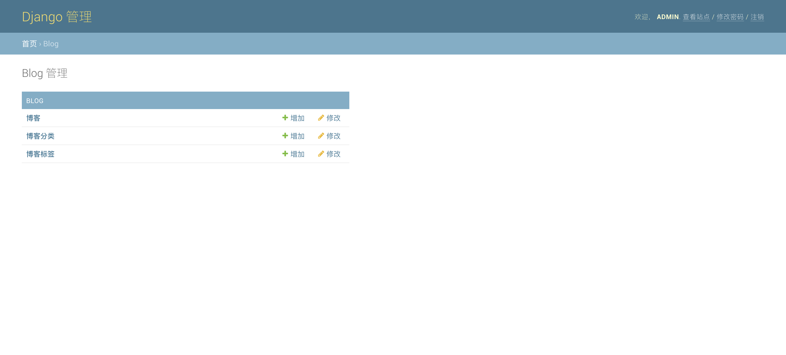

打开"博客"：
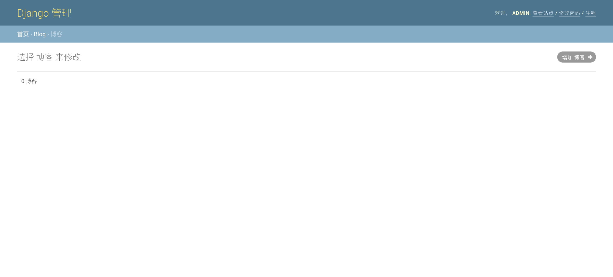

添加"博客"：
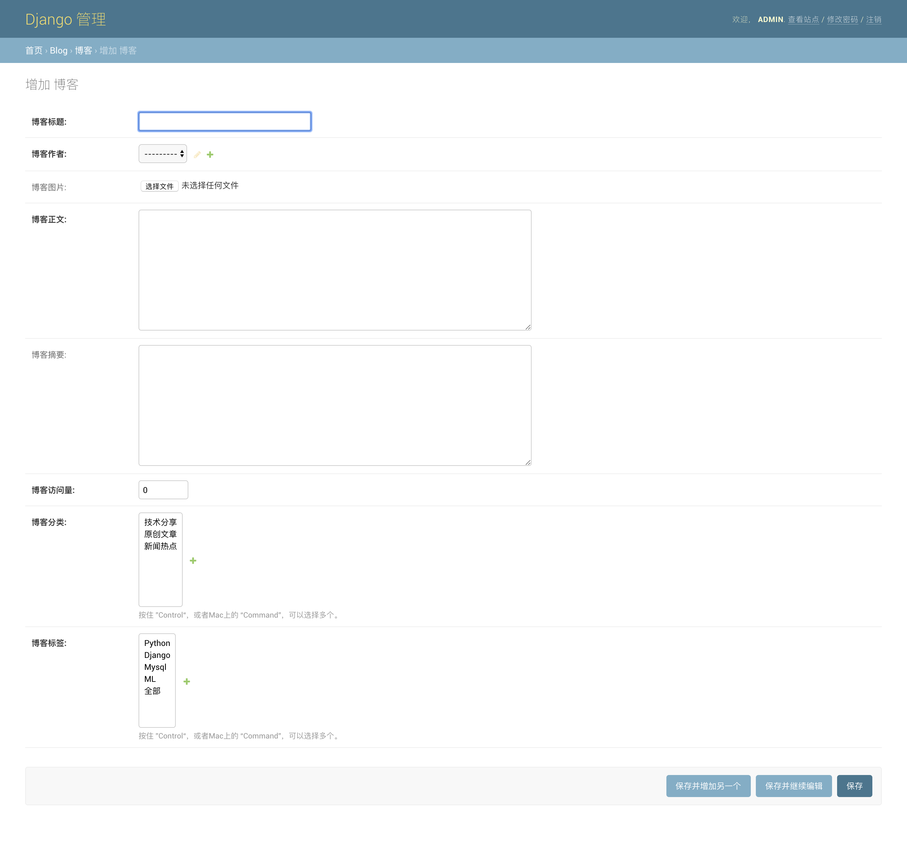

创建"新用户"：
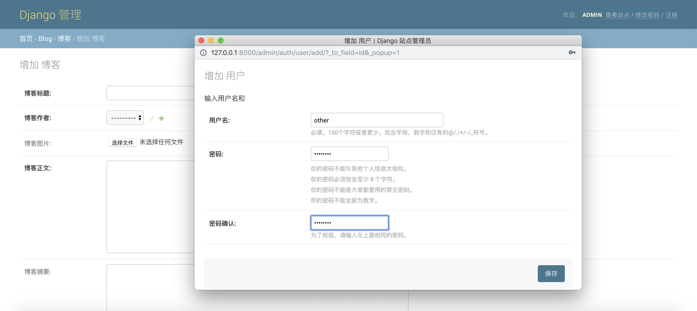
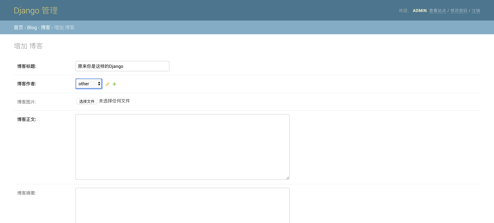

添加"博文"：
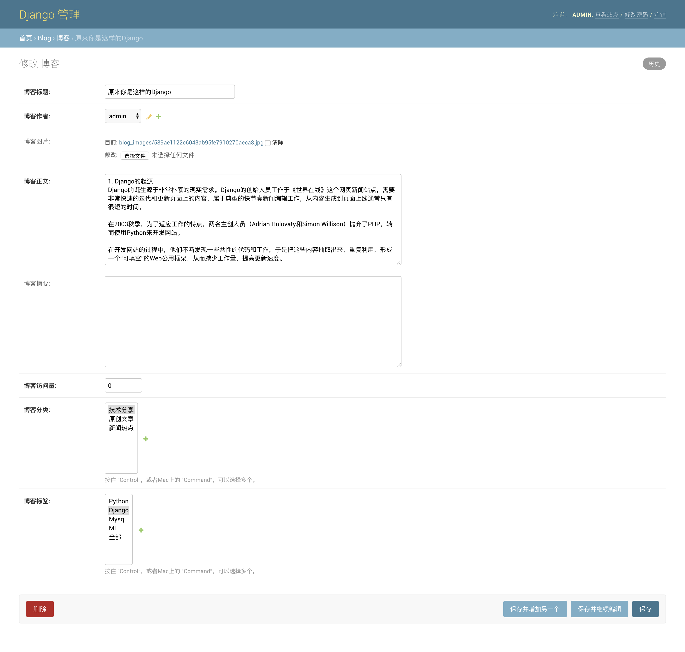
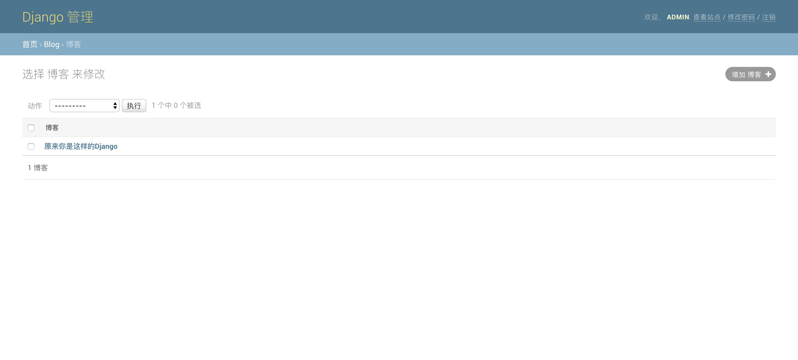

查看"上传图片路径"：
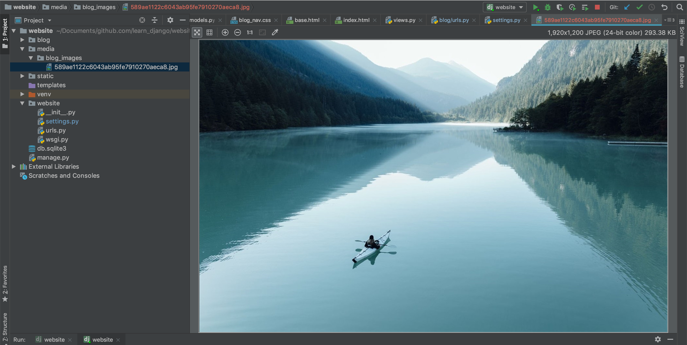

添加"多条博文"：
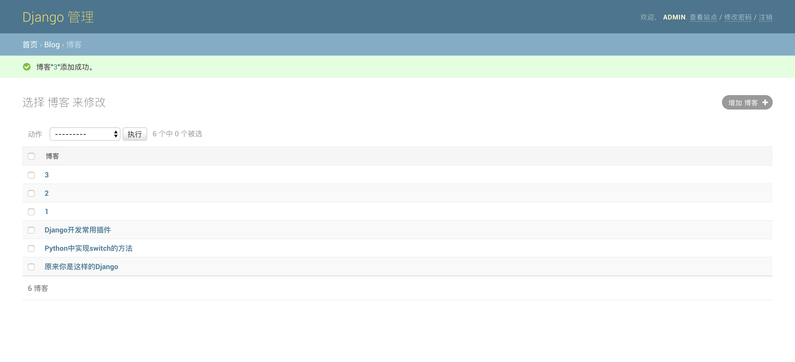

查看"当然博客"：
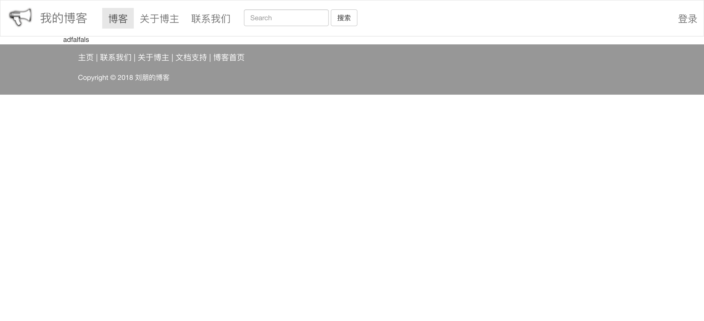

```bash
此时，我们需要将添加的博文从前端页面展示出来！
```

4.编辑"website/blog/views.py"
```bash
from django.shortcuts import render

# 要展示所有博客，就需要先导入models
from . import models

# Create your views here.


def index(request):
    # 获取所有博客
    entries = models.Entry.objects.all()

    return render(request, 'blog/index.html', locals())


# 由于路由中有传参，所以定义视图时，需要把参数也写上
def detail(request, blog_id):
    return render(request, 'blog/detail.html', locals())
```

5.编辑"website/blog/models.py"
```bash
from django.db import models
from django.contrib.auth.models import User
# 导入reverse模块
from django.urls import reverse

# 博客模型
class Entry(models.Model):
    title = models.CharField(max_length=128, verbose_name='博客标题')
    author = models.ForeignKey(User, verbose_name='博客作者')
    img = models.ImageField(upload_to='blog_images', null=True, blank=True, verbose_name='博客图片')
    body = models.TextField(verbose_name='博客正文')
    abstract = models.TextField(max_length=256, null=True, blank=True, verbose_name='博客摘要')
    visiting = models.PositiveIntegerField(default=0, verbose_name='博客访问量')
    category = models.ManyToManyField('Category', verbose_name='博客分类')
    tags = models.ManyToManyField('Tag', verbose_name='博客标签')
    created_time = models.DateTimeField(auto_now_add=True, verbose_name='创建时间')
    modified_time = models.DateTimeField(auto_now=True, verbose_name='修改时间')

    def __str__(self):
        return self.title

    def get_absolute_url(self):
        # blog:blog_detail ,blog是APP名字；blog_detail是urls中定义的路由名字
        # 将self.id传参给blog_id,然后使用blog应用中的blog_detail路由规则
        # 生成的url地址类如：http://127.0.0.1:8000/blog/3
        return reverse('blog:blog_detail', kwargs={'blog_id': self.id})

    class Meta:
        ordering = ['-created_time']
        verbose_name = '博客'
        verbose_name_plural = '博客'

```

6.查看"website/blog/urls.py"
```bash
# 导入url模块
from django.conf.urls import url
# 导入view试图模块
from . import views


#定义APP名字
app_name = 'blog'


urlpatterns = [
    url(r'^$', views.index, name='blog_index'),
    url(r'^(?P<blog_id>[0-9]+)', views.detail, name='blog_detail'),
]
```

7.编辑"website/blog/templates/blog/index.html"
```bash

博客首页


    <div class="container">
        <div class="row">
            <div class="col-md-9">
                
                    <h2><a href="{{ entry.get_absolute_url }}">{{ entry.title }}</a></h2>
                
            </div>
        </div>
    </div>

```

8.重启服务，查看博客
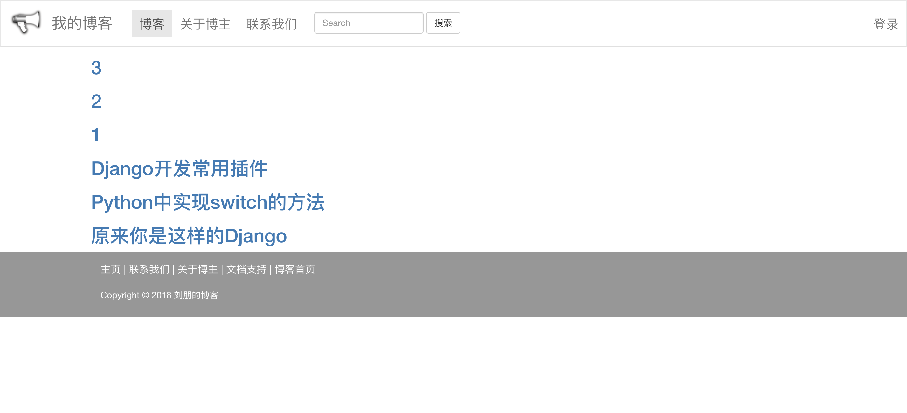

9.点击"3"博文

```bash
我们发现展示的内容如上图，说明detail.html还没有展示博文内容。
```

10.编辑"website/blog/templates/blog/detail.html"
```bash

博客详细页面


    博客{{ blog_id }}的详细页面

```

11.刷新浏览器，点击"3"进行查看

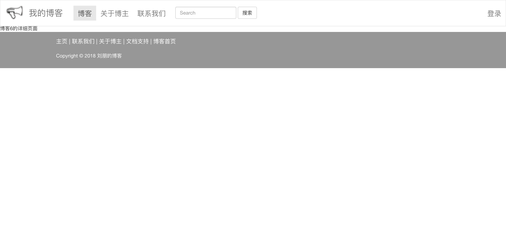

12.编辑"website/blog/templates/blog/index.html",展示摘要
```bash

博客首页


    <div class="container">
        <div class="row">
            <div class="col-md-9">
                
                    <h2><a href="{{ entry.get_absolute_url }}">{{ entry.title }}</a></h2>
                    <!--判断摘要是否存在，存在展示；不存在展示body，截取其中的128位进行显示-->
                    
                        <p>{{ entry.abstract }}</p>
                    
                        <p>{{ entry.body | truncatechars:128 }}</p>
                    
                
            </div>
        </div>
    </div>

```

13.刷新浏览器，进行展示
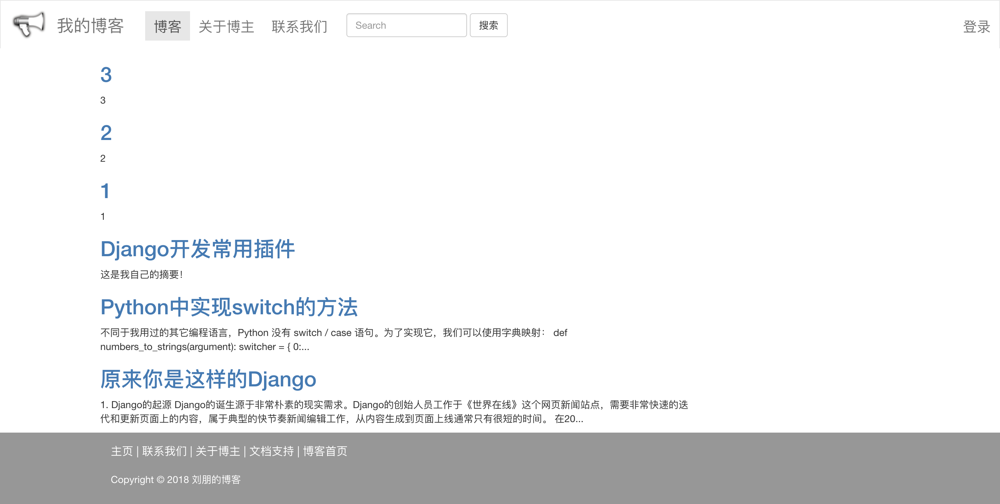

14.编辑"website/blog/templates/blog/index.html",展示作者，展示博文发布时间，浏览量
```bash

博客首页


    <div class="container">
        <div class="row">
            <div class="col-md-9">
                
                    <br />
                    <h2><a href="{{ entry.get_absolute_url }}">{{ entry.title }}</a></h2>
                    <!--判断摘要是否存在，存在展示；不存在展示body，截取其中的128位进行显示-->
                    
                        <p>{{ entry.abstract }}</p>
                    
                        <p>{{ entry.body | truncatechars:128 }}</p>
                    
                    <!--展示作者信息，博文发表时间，浏览量-->
                    <p>
                        <span>作者：{{ entry.author }}</span>
                        <span>&nbsp;&nbsp;&nbsp;&nbsp;发表时间：{{ entry.created_time }}</span>
                        <span>&nbsp;&nbsp;&nbsp;&nbsp;浏览量：{{ entry.visiting }}</span>
                    </p>
                
            </div>
        </div>
    </div>

```

15.刷新浏览器，进行查看
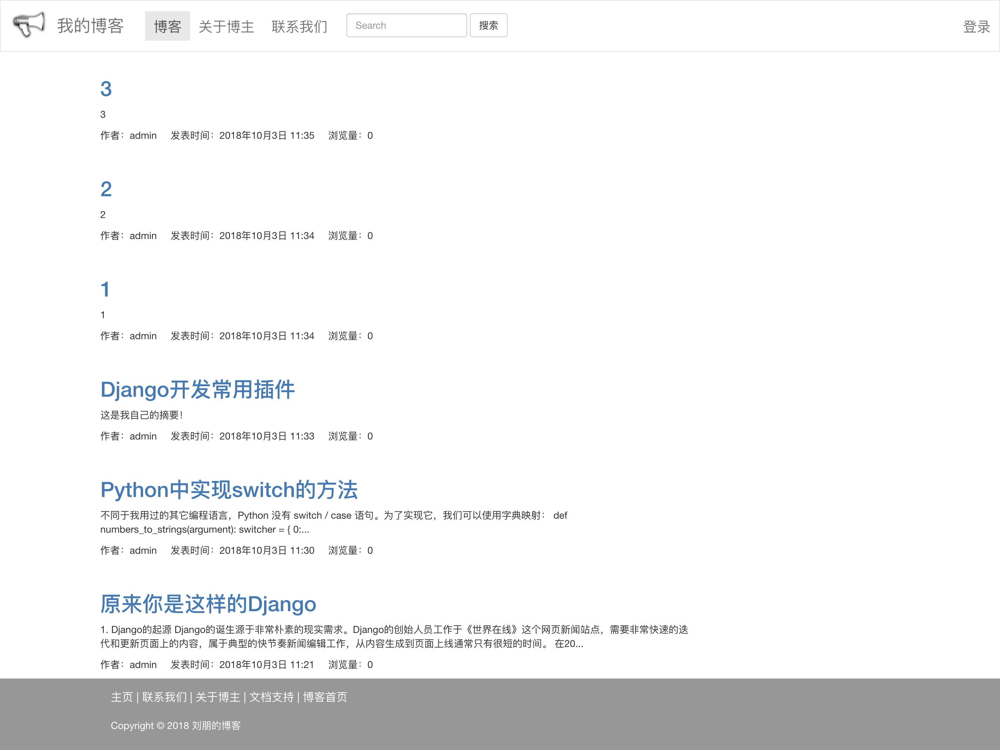


16.编辑"website/website/urls.py"，加载静态图片
```bash
from django.conf.urls import url
from django.contrib import admin
# 导入include模块
from django.conf.urls import include
# 导入静态图片路由
from django.conf import settings
from django.conf.urls.static import static


urlpatterns = [
    url(r'^admin/', admin.site.urls),
    # 创建二级路由(转向APP自己路由地址)
    url(r'^blog/', include('blog.urls')),
] + static(settings.MEDIA_URL, document_root=settings.MEDIA_ROOT)
```

17.编辑"website/blog/templates/blog/index.html",展示图片
```bash

博客首页


    <div class="container">
        <div class="row">
            <div class="col-md-9">
                
                    <br />
                    <h2><a href="{{ entry.get_absolute_url }}">{{ entry.title }}</a></h2>
                    <!--展示配图-->
                    
                        <div></div>
                    
                    <!--判断摘要是否存在，存在展示；不存在展示body，截取其中的128位进行显示-->
                    
                        <p>{{ entry.abstract }}</p>
                    
                        <p>{{ entry.body | truncatechars:128 }}</p>
                    
                    <!--展示作者信息，博文发表时间，浏览量-->
                    <p>
                        <span>作者：{{ entry.author }}</span>
                        <span>&nbsp;&nbsp;&nbsp;&nbsp;发表时间：{{ entry.created_time }}</span>
                        <span>&nbsp;&nbsp;&nbsp;&nbsp;浏览量：{{ entry.visiting }}</span>
                    </p>
                
            </div>
        </div>
    </div>

```

18.刷新浏览器，进行展示
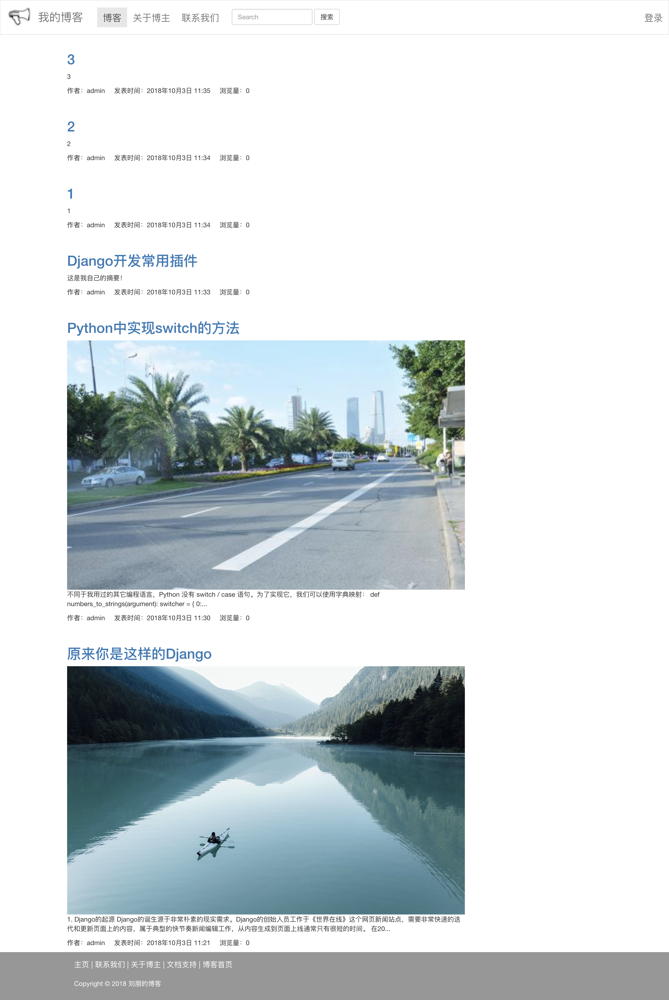

19.编辑"website/blog/models.py",设置浏览量的方法
```bash
# 博客模型
class Entry(models.Model):
    title = models.CharField(max_length=128, verbose_name='博客标题')
    author = models.ForeignKey(User, verbose_name='博客作者')
    img = models.ImageField(upload_to='blog_images', null=True, blank=True, verbose_name='博客图片')
    body = models.TextField(verbose_name='博客正文')
    abstract = models.TextField(max_length=256, null=True, blank=True, verbose_name='博客摘要')
    visiting = models.PositiveIntegerField(default=0, verbose_name='博客访问量')
    category = models.ManyToManyField('Category', verbose_name='博客分类')
    tags = models.ManyToManyField('Tag', verbose_name='博客标签')
    created_time = models.DateTimeField(auto_now_add=True, verbose_name='创建时间')
    modified_time = models.DateTimeField(auto_now=True, verbose_name='修改时间')

    def __str__(self):
        return self.title

    # 添加自动生成路由路径的方法
    def get_absolute_url(self):
        # blog:blog_detail ,blog是APP名字；blog_detail是urls中定义的路由名字
        # 将self.id传参给blog_id,然后使用blog应用中的blog_detail路由规则
        # 生成的url地址类如：http://127.0.0.1:8000/blog/3
        return reverse('blog:blog_detail', kwargs={'blog_id': self.id})

    # 添加访问量更新方法
    def increase_visitting(self):
        self.visiting += 1
        self.save(update_fields=['visiting'])

    class Meta:
        ordering = ['-created_time']
        verbose_name = '博客'
        verbose_name_plural = '博客'
```

20.编辑"website/blog/templates/blog/views.py",引用展示浏览量方法
```bash
from django.shortcuts import render

# 要展示所有博客，就需要先导入models
from . import models

# Create your views here.


def index(request):
    # 获取所有博客
    entries = models.Entry.objects.all()

    return render(request, 'blog/index.html', locals())


# 由于路由中有传参，所以定义视图时，需要把参数也写上
def detail(request, blog_id):
    # 获取浏览量的方法
    entry = models.Entry.objects.get(id=blog_id)
    entry.increase_visitting()
    return render(request, 'blog/detail.html', locals())
```

21.刷新浏览器，点击三次"3"博文后，进行观察浏览量
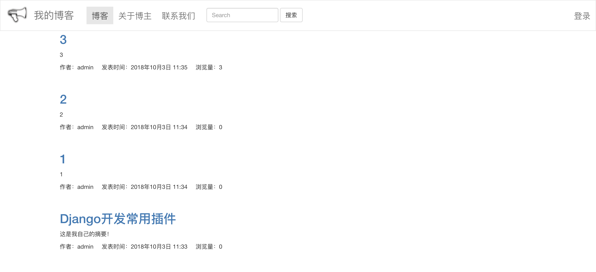


### 9.博客详细页面
1.编辑"website/blog/templates/blog/detail.html"
```bash

博客详细页面


    <div class="container">
        <div class="row">
            <div class="col-md-9">
                <!--展示标题-->
                <h1>{{ entry.title }}</h1>
                <!--展示博文信息-->
                <p>
                    <strong>{{ entry.author }}</strong>

                    &nbsp;&nbsp;&nbsp;&nbsp;{{ entry.created_time | date:'Y年m月d日'}}

                    &nbsp;&nbsp;&nbsp;&nbsp;分类：
                    
                        &nbsp;&nbsp;<a href="">{{ category.name }}</a>
                    

                    &nbsp;&nbsp;&nbsp;&nbsp;标签：
                    
                        &nbsp;&nbsp;<a href="">{{ tag.name }}</a>
                    

                    &nbsp;&nbsp;&nbsp;&nbsp;浏览量：
                        &nbsp;&nbsp;{{ entry.visiting }}
                </p>

                <!--展示配图-->
                
                    <div></div>
                

                <hr />

                <p>{{ entry.body }}</p>
            </div>
        </div>
    </div>

```

2.刷新浏览器，进行展示
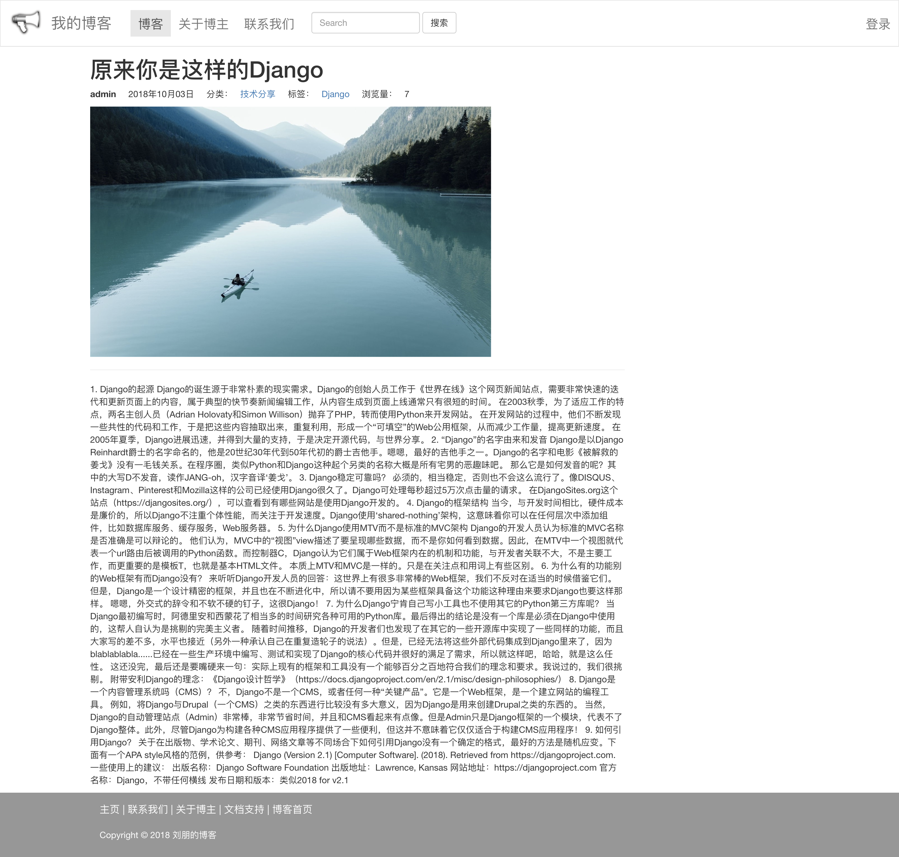
